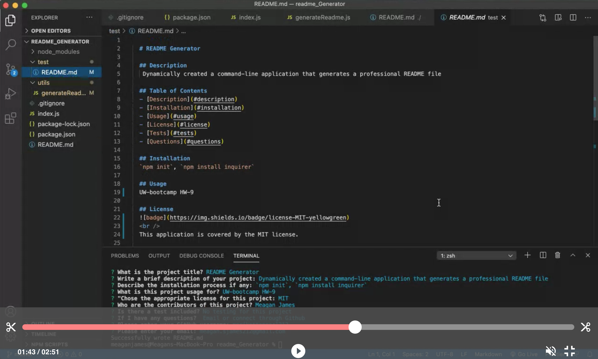

# Professional README Generator 

## Description
Dynamically created a command-line application that generates a professional README file. Its important to add a README file to projects that include what the project is for, how to use it, how to install it, how to report issues, and how to make contributions. 

Below is video showing the functionality of the application:  

## Installation
`npm init`, `npm install inquirer`

## Contributions
[Meagan James](https://github.com/merikettapearl212)

## Questions 
Repo: https://github.com/merikettapearl212/readme_Generator 
GitHub: [merikettapearl212](https://github.com/merikettapearl212) 
   
